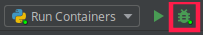

# Social Coach - backend

### inicialização do ambiente 

>Step-by-step setup tutorial of the Marketplace's backend.
>
>The tutorial assumes that the user's OS is UNIX based, **if not make the appropriate changes and select the correct OS in the documentation**. 
>
>_If running on Windows remember to enable Hyper-V and virtual environments._ 

#### Pre Requiments
* [Docker](https://docs.docker.com/engine/install/debian/)
> create docker group, _**you'll probably have to reboot after this**_.
```shell script
sudo groupadd docker
sudo usermod -aG docker $USER
```
* [Docker Compose](https://docs.docker.com/compose/install/)

#### Git clone
>[Clone the project](https://github.com/thinkideaapp/44express-backend) and go to the chosen directory, for example:
```shell script
git clone https://github.com/thinkideaapp/sensi-backend-init.git
cd ~/sensi-backend-init
```

#### GitHub's registry login

> See how to generate a GitHub token: * [Personal access token with access to GitHub packages](https://docs.github.com/en/github/authenticating-to-github/creating-a-personal-access-token)

```shell script
echo <your-personal-access-token> | docker login docker.pkg.github.com --username <your-username> --password-stdin
```

#### Pycharm Integration
>It's possible to run your container and debug with it using PyCharm.

* Build, Execution, Deployment
>To enable docker in PyCharm go to: File>Settings>Build,Execution,Deployment>Docker
> 
>Click in the **+** icon and use the default settings

* Project Interpreter
>We need to create a remote python interpreter, basically the python interpreter running inside our container.
>
>Go to File>Settings>Project: 44express-backend>Python Interpreter
>
>Add a configuration clicking in the  icon and clicking on "Add" and configure it like so: 

* Run/Debug Configurations
>The final step in the setup is to configure the Run/Debug configuration, **create one using the Remote Interpreter**. 

#### Deploy
>First deploy
```shell script
docker-compose up --build
```
>Regular Deploy
```shell script
docker-compose up
 ```
>Once the project is up and running just debug the application by clicking in the debug icon 
>
>>You ready to go!

* Redeploy restoring all databases
```shell script
bash init.sh
```

#### Migrations and DB
>To make a migration on the database use:
```shell script
docker-compose exec api flask db migrate -m"<your message>"
```
>if there's a conflict with the migration heads, run:
```shell script
bash db-merge.sh
``` 
>If you wish to update the db dupms, use:
```shell script
bash db-dump
```

### autenticação no swagger

> cole o link no seu navergador após a inicialização do docker-compose up --build:
``` shell script
http://127.0.0.1:4130/docs#/ 
```

> click no botão Authorize


<br>

>coloque a key informada a baixo no "api_key (apiKey)":

b2ZlcnRhcGxheXVzZXI6b2ZlcnRhcGxheXBhc3N3b3Jk


<br>

>click em authorize


<br>

>Entre na rota Token


<br>

>click em Try it out


<br>

>click em execute


<br>

>copie o jwt sem as "aspas" gerado pelo rota token e cole no jwt  (http, Bearer). Pronto já pode visualizar as rotas


<br>


### Relatorio de tests

docker-compose exec api python -m pytest "tests" -p no:warnings --cov="app"

